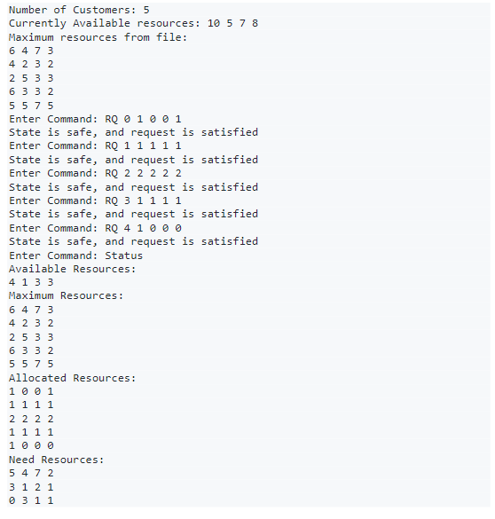
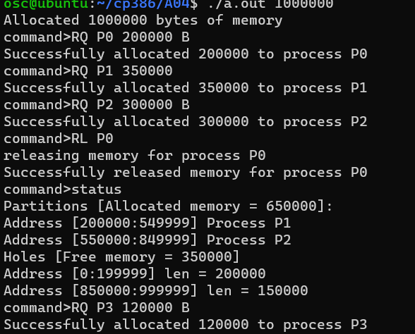
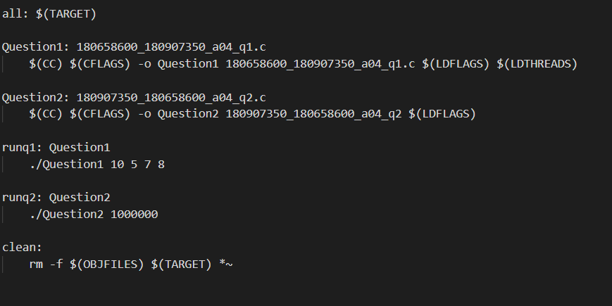

# CP386-A04
 
# Multi-threaded Bankers Algorithm Simulation

## Creator - Jake-77
## Features
Simulates an enviorment where their are multiple threads which need a         certain amount of resources to execute. Users can request and release         resources for each thread or automatically run them all. A safety             algorithm is used to ensure the system is always in a safe state after       every allocation. They can also check the status or exit the program at       any time.
## Test Cases
In the command line: 10 5 7 8 (included in the makefile call for q1)
## Functions and Stuctures
## typedef struct banker
    int available[4];
    int maximum[5][4];
    int allocation[5][4];
    int need[5][4];
    //The banker which keeps track of 5 threads with 4 resource types
## typedef struct userArgs
    char command[10];
    int CID;
    int resources[4];
    //For the user commands
## typedef struct thread
    pthread_t handle;
    int rtNum;
    int numTs;
    int tid;
    //Stucture for threads
## void * threadRun(void *t);
    Threads execute this function during run command.
## int safety(int m, int n, Banker b);
    Ensures system is in safe state and calculate a safe execution sequence in current state.

## Use example
   
   !

# Contigious Memory Allocation Using Best-Fit Algorithm Simulation

## Creator - maroyanp
## Features
Essentially is a simulator that uses the Best-Fit algorithm for contiguous memory allocation of size MAX where addresses may range from 0 ... MAX − 1.

## The program has three basic commands:
### 1) Request for a contiguous block of memory (RQ)
### 2) Release of a contiguous block of memomry (RL)
### 3) Report the regions of free and allocated memomry (Status)

## Functions

## void uppercase(char *str);
    Is used to uppercase each letter that a user inputs

## void bestfit(Allocation *userArgs, int *table, const int MAX);
    is the algorithum we created to best allocate memory

## void freemem(Allocation *userArgs, int *table, const int MAX);
    is used to free the memory from the similated enviornment

## int statusOFNOTEMPTY(Allocation *userArrgs, INMEM **allocated, int *table, const int MAX);
    DEPRECIATED

## void statusOfEmpty(int *table, const int MAX);
    is used to keep track of all holes the in the simulation

## void printTable(int *table, const int MAX);
    was used for testing purposes to see if the bestfit was working correcty.

## Use example
   
   
## Makefile
To use the make file provided (where q1 is the bankers algorithm and q2 is contigious memory allocation), make all (to run both), make runq1, make runq2

   

# About Developers

## Jake Lambkin:
    Third year studying at wilfrid laurier university

## Maroyan Putros
    Third year studying at wilfrid laurier university

# Licencensing
    Open Source.
